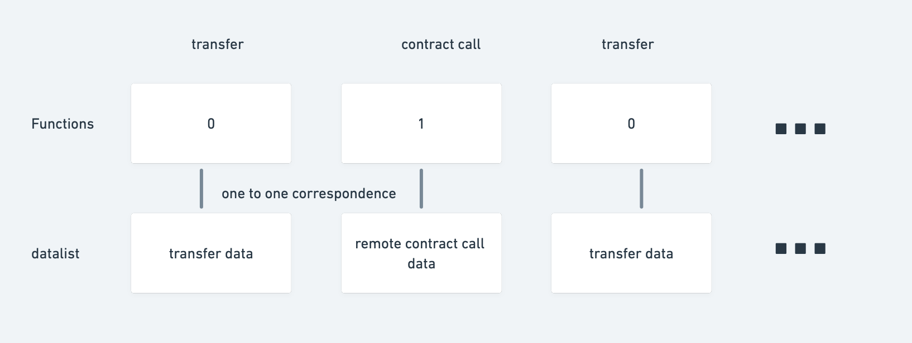

# Step1: Construct Cross-Chain Packet DataType

Teleport’s strong XIBC infrastructure supports you to perform both remote contract calls and cross-chain transfers. To specify actions, the first thing you need to do is to construct cross-chain data. 

Then you can use the data to invoke XIBC’s application contracts to start the process.

Here is the dataType library you should include in your codebase, you can find all these data here:

[xibc-contracts/evm/contracts/libraries/app at main · teleport-network/xibc-contracts](https://github.com/teleport-network/xibc-contracts/tree/main/evm/contracts/libraries/app)

Transfer Data:

```solidity
struct TransferData {
        address tokenAddress; // zero address if base token
        string receiver; 
        uint256 amount;
        string destChain; 
        string relayChain; // "" if one Hop
    }
```

RemoteContractCall Data:

```solidity
struct RCCData {
        string contractAddress; 
        bytes data; // contract abi data
        string destChain;
        string relayChain; //"" if one Hop
    }
```

MulticallData:

```solidity
struct MultiCallData {
        string destChain;
        string relayChain; // "" if 1-Hop
        uint8[] functions; // 0 - Transfer action 1- RCC action
        bytes[] data; // TransferData / RCCData
    }

    struct TransferData {
        address tokenAddress; // zero address if base token
        string receiver; //Receiver address on the destination Chain
        uint256 amount; 
    }

    struct RCCData {
        string contractAddress; //dest contact address
        bytes data; //Contract Abi
    }

```

Here is a diagram to explain the MulticallData Structure.



In the functions list, you can specify how many actions in want to include in this Multicall. (We would possibly limit this to 1 RCC and 1 Transfer max).

0 means Transfer action and 1 means RCC action.

The data list should be filled with the corresponding data type (MulticallDataType.TransferData/RCCData).

Now you have the Data, you can use the data as a parameter to Invoke the XIBC application Contract.